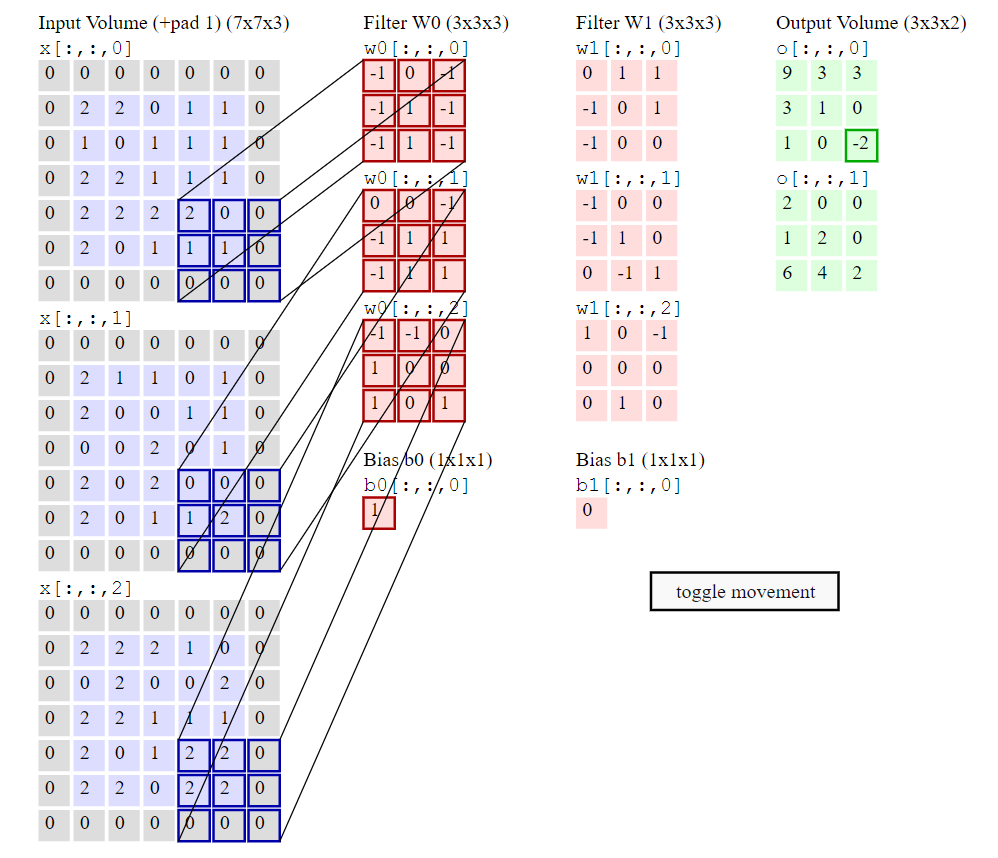
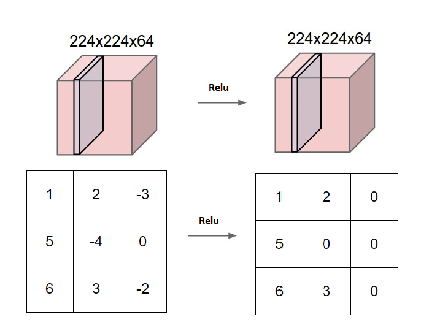

# Dokumentacja

## Specyfikacja projektu

### Cel

Celem projektu jest zdobycie wiedzy o działaniu konwolucyjnych sieci neuronowych i na tej podstawie stworznie własnej implementacji prostego systemu OCR ( ang. Optical Character Recognition ) . Dążymy do tego, by program był w stanie analizować zdjęcia wydrukowanych tekstów i odczytywać zawarty na nich napis. Naszym głównym będzie stworzenie naiwnej implementacji sieci konwolucyjnej ( ang. Convolutional Neural Networks – CNN ) w języku C. Ze względu na założenia, napisany kod będzie wolniejszy od produkcyjnych biblotek, jednak nauczy nas zasady działania sięci CNN.

### Wejscie

Program na wejściu bedzie otrzymywał zdjęcie w postaci bitmapy.

### Działanie

Program bedzie skłądał się z dwóch sięci neuronowych które bedą miały poniższe role:
* Analiza z ilu znaków skłąda się słowo wejściowe w zakresie od 0 do _N_, gdzie N = 10.
* Analiza jaki znak jest na _i_-tej pozycji słowa o długości _n_.

Tym samym algorytm bedzie polegał na tym żeby podać wejsciowy obrazek do pierwszej sieci i ustalenie liczby _n_. Następnie w pętli dla _i_ = 1 do _i_ = _n_ bedziemy pytać drugiej sięci jaki znak znajduje się na _i_-tej pozycji słowa. Odczytane znaki zostaną połączone w słowo. 

### Wyjście

Wypisanie w konsoli odczytanego słowa, które znajduje się na wejściowym zdjeciu.

### Możliwe roszerzenia

* Obsługa zdjeć w róznych rozdzielczości.  
Zdjecią były preprocesowane w celu przeskalowaniu zdjećia do formatu który przyjmuje na wejście CNN.
* Odczytywanie tekstu a nie słów.  
Ze zdjecia zostaną wyizolowane i przekazane podstawowemu projektowi pojedyncze słowa. Na wyjściu zostanie wyświetlony odczytany tekst jako połaczenie słów odczytanych przez bazowy program. => Większy preprocesing i postprocesing.
* Rozpoznawanie pisma recznie napisanego  
Dodanie odczytywanie pisma odrecznie napisanego lub "recznie" w programie graficznym. => Więcej wyjść w drugiej sięci neuronowej. => Dłuższy czas uczenia.
* Dodanie kolejnych znaków do alfabetu  
Dodanie odczytywanie pisma odrecznie napisanego lub "recznie" w programie graficznym. => Więcej wyjść w drugiej sięci neuronowej. => Dłuższy czas uczenia.
* Zwiekszenie długości otrzymanego słowa.  
Możemy zwiekszyć maksymalną długość wejściowego słowa _N_ do np 100. => Więcej wyjść w pierszej sięci neuronowej. => Dłuższy czas uczenia.


## Plan projektu

Plan ma charakter orientacyjny i bedzię zmieniany w trakcie realizacji projektu.

1. Wiedza teoretyczna  
Zdobycie wiedzy teoretyczniej potrzebnej do implementacji projektu. W tym:
    1. Rozpoznanie i wybranie odpowiednich egzemplarzy wśród dostepnej literatury.
    2. Zapoznanie się z literaturą.
    3. Zdefiniowanie specyfikacji projektu na postawie zdobytej wiedzy.
2. Przygotowanie narzędzi  
Napisaniu zestawu narzędzi:
   1. Bibloteka matematyczna
   2. Bibloteka CNN
   3. Bibloteka do parsowania plików graficznych
   4. Generator danych testowych ( python? )
3. Realizacja pierwszej CNN  
Stworzenie i wytrenowanej sieci, która rozpoznaje liczbę znaków podaną na zdjęciu.
4. Realizaja drugiej CNN  
Stworzenie sieci, która jest wstanie podać znak na podstawie bitmapy słowa i jego pozycji w tym słowie.
5. Połączenie w całość  
Połaczenie dwoch sieci neuronowych w jeden program, tak aby spełniał specyfikacje.
6. Realizowanie roszerzenie projektu  
Etap będzie polegał na dodawaniu dodatkowych funkcjonalnosći.

## Literatura
* [Convolutional Neural Networks for Visual Recognition](http://cs231n.github.io/) – kurs konwolucyjnej sieci neuronowej ze stanforda (głowne źródło wiedzy)
* „Deep Learning” – lan Goodfellow (książka zawierająca wiedzę teoretyczną)
* ["Machine Learning" by Andrew Ng](https://www.coursera.org/learn/machine-learning)

## Model

### Model neuronu


### FC vs CNN


### Warstwa Conv




### Warstwa Relu



### Warstwa Pool


### CNN in action


Model bedzie postaci:
```
INPUT -> [[CONV -> RELU]*N -> POOL?]*M -> [FC -> FC_RELU]*K -> FC -> OUT | N,M,K >= 0
```

Ponieważ nasza sięc neuronowa bedzie się stosunkowo długo uczyć zastosujemy najprawdopodobniej jedna z możliwości:
* N = M = K = 1
* N = 2, M = K = 1
* N = K = 1, M = 2
    
## Bibloteki

Bibloteki będa napisana w jezyku C bez użycia zewnętrznych biblotek, aby program był łatwo przenaszalny miedzy platformami. Poniżej zostały opisane mniej więcej struktura biblotek.

