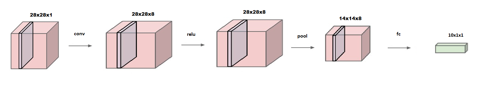

# SCOTR - Dokumentacja

Simple Convolutional neural network Optical Text Recognition

Anna Bukowska i Radomir Krawczykiewicz

## Specyfikacja projektu

### Cel

Celem projektu jest przede wszystkim poznanie konwolucyjnych sieci neuronowych, przestudiowanie zagadnień z nimi związanych oraz na podstawie zdobytej wiedzy - stworzenie własnej implementacji prostego systemu OCR ( ang. Optical Character Recognition ). Wszystkie elementy dotyczące istoty sieci konwolucyjnych ( ang. Convolutional Neural Networks – CNN ) będą tworzone przez nas samodzielnie w języku C.

Uwaga: Ze względu na założenia, napisany kod będzie znacznie wolniejszy od produkcyjnych biblotek. Nie służy on jednak jako produkt informatyczny, a jako narzędzie do nauki idei sieci CNN.

### Wejście

Program na wejściu bedzie otrzymywał zdjęcie w postaci bitmapy.

### Działanie

Ze względu na dość powolne uczenie się sieci zrezygnowaliśmy z pierwotnej wersji projektu, zawężając alfabet do cyfr arabskich. Nie wpłynęło to na główny cel implementacyjny (samodzielne stworzenie bibliotek oraz przykładu sieci konwolucyjnej), a znacznie ułatwiło pracę nad kodem poprzez zmniejszenie ilości czasu potrzebnego na naukę sieci.

Obecnie sieć rozpoznaje przedstawioną na zdjęciu ręcznie napisaną cyfrę arabska. Do uczenia i testowania użyliśmy bazy danych [MNIST](http://yann.lecun.com/exdb/mnist/).

### Wyjście

Wypisanie w konsoli cyfry, która znajduje się na wejściowym zdjeciu.

### Możliwe roszerzenia

* Obsługa zdjeć w różnych rozdzielczościach. (Biblioteka pozwala na realizację różnych rodzielczosci)
Zdjecia byłyby preprocesowane w celu przeskalowania zdjęcia do formatu, który przyjmuje na wejście CNN.
* Dodanie kolejnych znaków do alfabetu  
Dodanie liter alfabetu angielskiego. => Więcej wyjść w drugiej sięci neuronowej. => Dłuższy czas uczenia.
* Odczytywanie słów.  
Ze zdjecia zostaną wyizolowane i przekazane podstawowemu projektowi pojedyncze słowa. Na wyjściu zostanie wyświetlony odczytany tekst jako połaczenie słów odczytanych przez bazowy program. => Większy preprocesing i postprocesing. (Wymagane dodanie liter, patrz punkt wyżej)

## Plan projektu

Plan ma charakter orientacyjny i może być zmieniany w trakcie realizacji projektu.

1. Wiedza teoretyczna  
Zdobycie wiedzy teoretyczniej potrzebnej do implementacji projektu. w tym:
    1. Rozpoznanie i wybranie odpowiednich egzemplarzy wśród dostepnej literatury.
    2. Zapoznanie się z literaturą.
    3. Zdefiniowanie specyfikacji projektu na postawie zdobytej wiedzy.
2. Przygotowanie narzędzi  
Napisanie zestawu narzędzi:
   1. Bibloteka matematyczna
   2. Bibloteka CNN
   3. Bibloteka do parsowania plików graficznych ( IOlib )
   4. Generator danych testowych ( w języku python )
3. Realizacja CNN  
Stworzenie i wytrenowanie sieci, która rozpoznaje cyfrę podaną na zdjęciu.
6. Podsumowanie i wyciągnięcie wniosków  
Etap będzie polegał na krytycznym przyjrzeniu się projektowi i podsumowaniu jego przebiegu oraz wyników.

## Literatura
* [Convolutional Neural Networks for Visual Recognition](http://cs231n.github.io/) – kurs konwolucyjnej sieci neuronowej ze stanforda (głowne źródło wiedzy)
* „Deep Learning” – lan Goodfellow (książka zawierająca wiedzę teoretyczną)
* ["Machine Learning" by Andrew Ng](https://www.coursera.org/learn/machine-learning)

## Bibloteki

Bibloteka CNN i matematyczna będą napisane w jezyku C bez użycia nietypowych zewnętrznych biblotek, aby program był łatwo przenaszalny miedzy platformami.

W naszym projekcie użyliśmy jednej bibloteki zewnetrznej [stb_images](https://github.com/nothings/stb).

Generator testów oraz obrazków captcha został napisany w pythonie i ma osobną [dokumentacje](https://github.com/Kotwic4/SCOTR/blob/master/generator/README.MD).

## Convolutional Neural Networks (CNNs / ConvNets) - Podsumowanie wiedzy teoretycznej

Krótkie podsumowanie wiedzy zdobytej z [kursu stanforda](http://cs231n.github.io/).

### Model neuronu

Sięci neuronowe składają sie z tytułowych neuronów.
Neurony mają swoje wagi oraz funkje aktywacji.
W przypadku sieci CNN operujemy na tensorach(trójwymiarówych tablicach).


### Fully-Connected

W warstwie FC każdy neuron trzyma osobna wage dla każdego wyjścia poprzedniej warstwy.


#### Parametry
* Rozmiar poprzedniej warstwy
* Ilość neuronów

### Convolutional

Warstwa Convolutional trzyma wagi w postaci filtrów które poruszają się po wyjściu poprzedniej warstwy.


Live demo is [here](http://cs231n.github.io/convolutional-networks/#conv)

#### Parametry
* Rozmiar poprzedniej warstwy
* Stride (przesuniecie filtra)
* SpatialExtent (rozmiar filtra)
* Padding (zwiekszenie zerami)
* Ilość filtrów

### Rectified Linear Unit

Warstwa Relu usuwa szum(wartości ujemne) z poprzedniej warstwy.


#### Parametry
* Rozmiar poprzedniej warstwy

### Pooling

Warstwa Pool robi downsampling wyjścia poprzedniej warstwy po przez np funkcje max.


#### Parametry
* Rozmiar poprzedniej warstwy
* Stride (przesuniecie filtra)
* SpatialExtent (rozmiar filtra)

### CNN in action

Sięc neuronową można analizować graficznie po przez rozbicie tensorów na obrazki.


### Schemat budowy
Model bedzie postaci:
```
INPUT 
-> [[CONV -> RELU]*N -> POOL?]*M 
-> [FC -> FC_RELU]*K 
-> FC 
-> OUTPUT
| N,M,K >= 0
```

## Prosty przykład

### Opis

Dane przedstawia poniższa tabelka:

| 0 | 1 | 2 | Wynik |
| ------------- | ------------- | ------------- | ------------- |
| 0 | 1 | 0 | 0 |
| 1 | 1 | 1 | 1 |
| 1 | 1 | 0 | 1 |
| 0 | 0 | 1 | 0 |
| 1 | 0 | 0 | ? |

Łatwo zauwazyć że wynik jest zależny jedynie od kolumny 0 tym samym wynik ostatniego wiersza powinien wynieśc 1

### Model

Przykładowa sięc neuronowa z jednym neuronem.

N = 0, M = 0, K = 0

```
INPUT -> FC -> OUTPUT
INPUT[3x1x1]
FC[1,1,1]
OUTPUT[1,1,1]
```

### Uczenie

Pierwsze 4 wiersze stanowiły baze do nauki sieci.
Były one uczone w 10'000 iteracji.

### Wynik

Sieć zwrócila wynik 0.988794 co możemy traktować jako 1, czego oczekiwaliśmy.

## MNIST

### Opis

Poniższy model został użyty w celu analizy obrazków [MNIST](http://yann.lecun.com/exdb/mnist/). Szczegółowy opis znajduję się na początku dokumentacji.

### Model

N = 1 , M = 1, K = 0

```
INPUT -> CONV -> RELU -> POOL -> FC -> OUTPUT
INPUT[28x28x1]
CONV(stride = 1, spatialExtent = 5, filter = 8, padding = 0)[28x28x8]
RELU[28x28x8]
POOL(stride = 2, spatialExtent = 2)[14x14x8]
FC[10,1,1]
OUTPUT[10,1,1]
```


### Uczenie i Testowanie

Zgodnie z baza danych sięc neuronowa uczyła się na 60'000 przykładach przez 40 iteracji.
Następnie była testowana na 10'000 przykładach których maszyna nie widziała wcześniej.
Za wynik sięci neuronowej przyjmowalismy najwyższy wynik na wyjściowych neuronach.
Porównywaliśmy wynik sieci z oczekiwany i zliczaliśmy ilośc przykładów na których wyniki się nie zgadzały.

### Wynik

Wyniki były rózne w 833 z 10'000.
Tym samym nasza sieć uzyskiwała poprawny wynik dla 91.67 % testów.
Jako że mamy 10 możliwych odpowiedzi, zgadywanie wyniku powinno skutkować wynikiem około 10%.

## Podsumowanie Projektu

### Mocne strony:
* został zrealizowany główny cel projketu - uczestniczenie w nim nauczyło nas zasad działania sieci konwolucyjnych
* projekt jest kompilowalny i działa poprawnie, sieć się uczy i rozpoznaje cyfry prawdopodobieństwiem z większym niż rozpoznawanie losowe
* realizacja postępowła zgodnie z planem, nie było znacznych opóźnień ani żadnych przerw w tworzeniu projektu

### Słabe strony:
* nauka sieci trwa bardzo długo, przez co byliśmy zmuszeni do okrojenia początkowo zakładanego alfabetu

### Wnioski:
w przyszłosci warto byłoby usprawnić bibliotekę CNN poprzez wprowadzenie odpowiednich narzędzi:
- wątków
- bibliotek umożliwiających obliczenia na karcie graficznej
- wektoryzowanie mnożenia macierzy

Jesteśmy bardzo zadowoleni z wyboru tematu projektu oraz przebiegu jego realizacji. Uważamy, że mimo pewnych przeszkód, został on zrealizowany adekwatnie do naszych możliwości. Dzięki niemu znacznie poszerzylismy swoją wiedzę i opanowaliśmy nowe dla nas narzedzie do informatycznej analizy obrazu.

