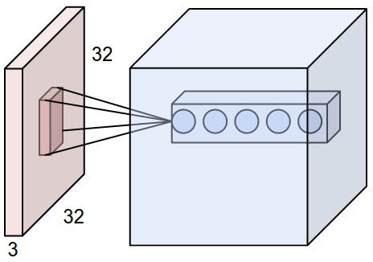

## Model

### Model neuronu


### Convolutional Neural Networks (CNNs / ConvNets)


### Fully-Connected


#### Parametry
* Rozmiar poprzedniej warstwy
* Ilość neuronów

### Convolutional




Live demo is [here](http://cs231n.github.io/convolutional-networks/#conv)

#### Parametry
* Rozmiar poprzedniej warstwy
* Stride (przesuniecie filtra)
* SpatialExtent (rozmiar filtra)
* Padding (zwiekszenie zerami)
* Ilość filtrów

### Rectified Linear Unit


#### Parametry
* Rozmiar poprzedniej warstwy

### Pooling


#### Parametry
* Rozmiar poprzedniej warstwy
* Stride (przesuniecie filtra)
* SpatialExtent (rozmiar filtra)

### CNN in action


### Schemat budowy

Model bedzie postaci:
```
INPUT -> [[CONV -> RELU]*N -> POOL?]*M -> [FC -> FC_RELU]*K -> FC -> OUTPUT | N,M,K >= 0
```

## Model CNN

N = 1 , M = 1, K = 0

```
INPUT -> CONV -> RELU -> POOL -> FC -> OUTPUT
INPUT[28x28x1]
CONV(stride = 1, spatialExtent = 5, filter = 8, padding = 0)[28x28x10]
RELU[28x28x10]
POOL(stride = 2, spatialExtent = 2)[14x14x10]
FC[10,1,1]
OUTPUT[10,1,1]
```

    
## Bibloteki

Bibloteka CNN i matematyczna będą napisane w jezyku C bez użycia nietypowych zewnętrznych biblotek, aby program był łatwo przenaszalny miedzy platformami.
